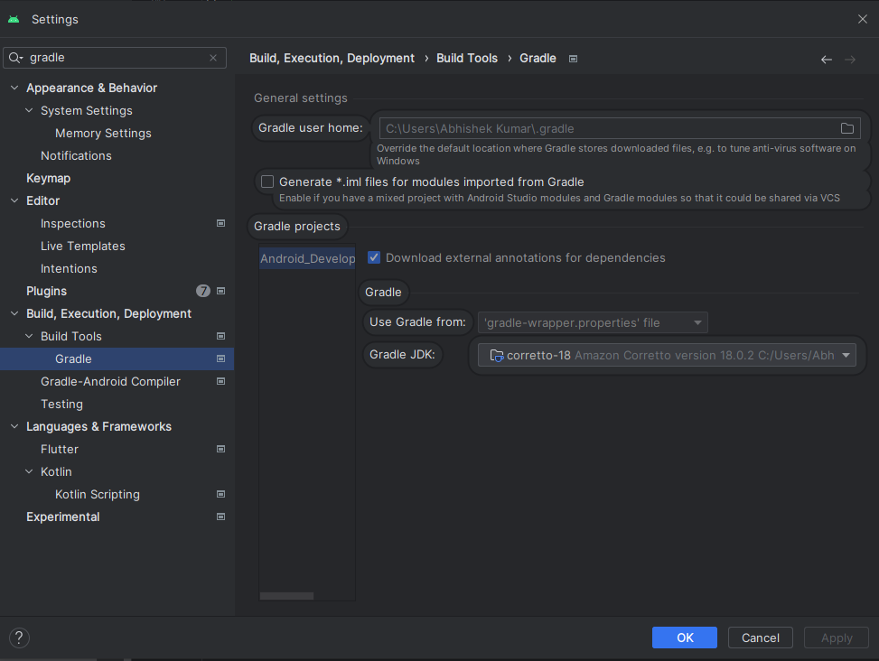

# MobileQuickLaunchKit Documentation

## Overview

MobileQuickLaunchKit is a mobile app development kit built using Jetpack Compose
and follows the Clean architecture pattern with a modular approach. It aims to
provide a quick and efficient setup for common functionalities required in
Android app development. The app is divided into multiple modules, each serving
a specific purpose.

## Table of contents

1. [Modules](./docs/modules.md)
2. [Installation](#installation)
3. [Usage](#usage)
4. [Mockoon Setup Instructions](./docs/mockoon_setup.md)
5. [API Setup](./docs/apis_setup.md)
6. [Troubleshoot](#troubleshoot)

## Installation

### Note

- You are welcome to utilize this repository for your professional endeavors and make adjustments to
  modules or the main app as necessary.
- If you prefer to include only specific modules, kindly follow the steps below before integrating
  them into your project.
- HILT is an integral part of this repository. Therefore, it is essential to configure HILT in your
  own project. Refer to the provided instructions [here](./docs/hilt_setup.md) after
  completing the initial setup.
- Firebase is utilized for enabling Google sign-in functionality. To integrate Firebase into your
  project, please follow the instructions provided [here](./docs/firebase_setup.md) after
  completing the initial setup..

### Prerequisites

**Software Requirements:**

- **Android Studio:** Install the latest version (3.0.1 or later) of Android Studio from the official website: [https://developer.android.com/studio](https://developer.android.com/studio).

**Configuration:**

1. **Maven Repository:**
    - In your project's `settings.gradle` file, include the following maven repository URLs:

    ```gradle
    dependencyResolutionManagement {
        repositoriesMode.set(RepositoriesMode.FAIL_ON_PROJECT_REPOS)
        repositories {
            google()
            mavenCentral()
            maven { url = uri("https://jitpack.io") }
        }
    }
    ```

2. **Project Dependencies:**
    - You have two options to integrate the project:

   **a. Include All Modules:**

    ```gradle
    implementation("com.github.mindfiredigital:MobileQuickLaunchKit-Android:<VERSION>")
    ```

   Replace `<VERSION>` with the desired version number.

   **b. Include Specific Module:**

    ```gradle
    implementation("com.github.mindfiredigital.MobileQuickLaunchKit-Android:<Modue_NAME>:<VERSION>")
    eg: 
    implementation("com.github.mindfiredigital.MobileQuickLaunchKit-Android:core:0.1.0")
    ```

   Replace `<MODULE_NAME>` with the name of the specific library you need and `<VERSION>` with the version number.

3. **Hilt Setup:**
    - Follow the instructions provided [here](./docs/hilt_setup.md) to configure Hilt dependency injection in your project.

4. **Firebase Setup:**
    - Integrate Firebase into your project by following the steps [here](./docs/firebase_setup.md). This is required for Google Sign-in functionality.

5. **Compose Version:**
    - Update your `build.gradle` file with the following Compose dependencies:

    ```gradle
    implementation("androidx.activity:activity-compose:1.8.0")
    implementation(platform("androidx.compose:compose-bom:2023.03.00"))
    ```

---

## Usage

### 1. Initialize Theme:

```kotlin
class MainActivity : FragmentActivity() {
    override fun onCreate(savedInstanceState: Bundle?) {
        super.onCreate(savedInstanceState)
        setContent {
            val window = rememberWindowSizeClass()
            MQLKTheme(
                windowSizeClass = window,
            ) {
                MyApp()
            }
        }
    }
}
```

Here `MQLKTheme` has `lightTheme` and `darkTheme` parameters where you can pass
your custom theme data as well.

```kotlin
val lightTheme: MQLKThemeModel = MQLKThemeModel(
    primary = Red,
    onPrimary = DefaultTextColor, // Text Color
    secondary = DarkGrey,
    tertiary = Pink40,
    background = Color.White,
    surface = Color.White,
)

val darkTheme: MQLKThemeModel = MQLKThemeModel(
    primary = LightPink,
    onPrimary = LightGrey,
    secondary = MedGrey,
    tertiary = Pink40,
    background = DarkBlue,
    surface = Ebony
)
```

### 2. Importing Screens:

You can easily import screens from different modules and create your own
nav-graph for navigation.

```kotlin
@Composable
fun SampleMQLKNavigationGraph(
    navController: NavHostController,
    startLocation: String,
    drawerState: DrawerState
) {
    NavHost(navController = navController, startDestination = startLocation) {
        // Define composable destinations and their corresponding routes
        composable(MQLKScreens.SplashScreen.route) {
            val viewModel: SplashScreenViewModel = hiltViewModel()
            MQLKSplashScreenUI(navController, viewModel)
        }

        composable(MQLKScreens.LoginScreen.route) {
            MQLKLoginScreen(navController, navigateTo = {
                navController.navigate(it)
            })
        }

        composable(MQLKScreens.SignupScreen.route) {
            MQLKSignUpScreen(navController, {
                navController.navigate(it)
            })
        }

        composable(MQLKScreens.ForgotPasswordScreen.route) {
            MQLKForgotPasswordScreen(navController, {
                navController.navigate(it)
            })
        }

        composable(MQLKScreens.OTPVerification.route) {
            MQLKOTPVerificationScreen(navController, {
                navController.navigate(it)
            })
        }

        composable(MQLKScreens.SetNewPassword.route) {
            MQLKSetNewPasswordScreen(navController, {
                navController.navigate(it)
            })
        }

        composable(MQLKScreens.HomeScreen.route) {
            MQLKHomeScreen(drawerState)
        }

        composable(MQLKScreens.SettingScreen.route) {
            MQLKSettingsScreen(navController)
        }

        composable(MQLKScreens.EditProfileScreen.route) {
            MQLKEditProfileScreen(navController)
        }

        composable(MQLKScreens.ChangePasswordScreen.route) {
            MQLKChangePasswordScreen(navController)
        }

        composable(
            MQLKScreens.WebView.route,
            arguments = listOf(navArgument("url") {
                type = NavType.StringType
            })
        ) {
            MQLKWebView(navController, it.arguments?.getString("url"))
        }
    }
}
```

Adjust these composable functions based on your specific navigation
requirements.

### 3. MQLKModelNavigationDrawerWrapper Composable

We have the `MQLKModelNavigationDrawerWrapper` composable available for
integrating a drawer into your app. Follow these steps:

1. **Wrap at Top Composable:**
    - Wrap this at the very top of your composable hierarchy.

2. **Pass Drawer State:**
    - Pass your drawer state as a parameter.

3. **Include Composable Items:**
    - Include all composable items that you want to show in your drawer.

4. **Use to Open or Close Drawer:**
    - Use this to open or close the drawer.

Example:

```kotlin
val drawerState = rememberDrawerState(initialValue = DrawerValue.Closed)

MQLKModelNavigationDrawerWrapper(
    drawerState,
    items = listOf(
        {
            NavigationDrawerItem(
                label = { Text(text = "Drawer Item") },
                selected = false,
                onClick = { MQLKUtilities.sharePlainText(context = context) },
                badge = {
                    Icon(Icons.Default.Email, null)
                },
                icon = {
                    Icon(Icons.Default.Phone, null)
                },
            )
        },
        {
            NavigationDrawerItem(
                label = { Text(text = "Drawer Item") },
                selected = false,
                onClick = { /*TODO*/ }
            )
        },
        {
            NavigationDrawerItem(
                label = { Text(text = "Drawer Item") },
                selected = false,
                onClick = { /*TODO*/ }
            )
        },
    )
) {
    // YourTopComposable()
    YourTopComposable()
}
```

### 4. MQLKBottomNavBar Composable

We have the `MQLKBottomNavBar` composable available for including a bottom
navigation bar in your app. Follow these steps:

1. **Pass Navigation Items and NavController:**
    - Pass your navigation items and NavController as parameters.

Example:

```kotlin
val navController = rememberNavController()
val navItems = listOf(
    MQLKNavItem(
        label = "Home", route = MQLKScreens.HomeScreen.route, icon = Icons.Default.Home
    ),
    MQLKNavItem(
        label = "Settings",
        route = MQLKScreens.SettingScreen.route,
        icon = Icons.Default.Settings
    ),
)

Scaffold(
    modifier = Modifier.clickable(
        indication = null,
        interactionSource = remember { MutableInteractionSource() }
    ) {
        focusManager.clearFocus()
    },
    containerColor = MaterialTheme.colorScheme.background,
    bottomBar = {
        val items = navItems.map {
            it.route
        }
        val navBackStackEntry by navController.currentBackStackEntryAsState()
        val currentRoute = navBackStackEntry?.destination?.hierarchy?.first()?.route

        // Responsible for showing the bottom navigation bar
        if (currentRoute !in items) return@Scaffold

        MQLKBottomNavBar(
            items = navItems,
            navController = navController
        ) {
            navController.navigate(it.route) {
                popUpTo(navController.graph.findStartDestination().id) {
                    saveState = true
                }
                launchSingleTop = true
                restoreState = true
            }
        }
    }
) { it ->
    SampleMQLKNavigationGraph(navController, MQLKScreens.SplashScreen.route, drawerState)
}
```

In this example, `navController` is created using `rememberNavController()` and
`navItems`represents the list of navigation items with labels, routes, and
icons. Adjust the items, routes, and actions based on your app's navigation
requirements.

Please go through Sample module to see all the implementation of all composables
and including modules

### 5. Utility

This section outlines various utility functions designed to streamline your workflow.

1. **MQLKDates**

    1. **getFormattedDateString**: This function accepts a `LocalDateTime` object and a `dateFormatter` and returns the date in the specified format as a string.

       **Example:**
       ```kotlin
       val resp = MQLKDates.getFormattedDateString(LocalDateTime.now(), "MM-DD-Y")
       print(resp)
       // Output: "02-40-2024"
       ```

    2. **changeDateFormat**: Use this function to convert the input date from one format to another. It requires the `inputDate` as a string, `inputFormat`, and `outputFormat`, returning the date in the desired format.

       **Example:**
       ```kotlin
       val resp = MQLKDates.changeDateFormat("2024-02-09T13:58:12.727283","yyyy-MM-dd'T'HH:mm:ss.SSSSSS","YY-MM-dd")
       print(resp)
       // Output: "24-02-09"
       ```

    3. **getFormattedTime**: This function provides flexibility in formatting time. It accepts the format of type `TimeFormat` (an enum) and `currentTime` as a `LocalDateTime` object, returning the formatted time in either 12-hour or 24-hour notation.

       **Example:**
       ```kotlin
       val resp = MQLKDates.getFormattedTime(MQLKDates.TimeFormat.TWENTY_FOUR_HOUR, LocalDateTime.now())
       print(resp)
       // Output: "02:01:18 pm" (12 hr) or "14:01:31" (24 hr)
       ```

    4. **parseDateStringToDate**: This function parses a date string based on the specified format (`inputFormat`) and returns a `LocalDateTime` object.

       **Example:**
       ```kotlin
       val resp = MQLKDates.parseDateStringToDate("2024-02-09T13:58:12.727283","yyyy-MM-dd'T'HH:mm:ss.SSSSSS")
       print(resp)
       // Output: "2024-02-09T13:58:12.727283" (LocalDateTime object)
       ```

2. **MQLKValidations**

   This document provides a detailed overview of the functions available in the `MQLKValidations` class. These functions are written in Kotlin and can be used for various validation purposes in your application.

    - **isValidNumericInput**

      **Description:** This function determines if the provided string is numeric or not.

      **Usage:**
      ```kotlin
      val resp = MQLKValidations.isValidNumericInput("435345.43")
      print(resp)
      // Output: true
      ```

    - **isValidEmailOrPhoneNumber**

      **Description:** This function determines if the provided string is a valid email address or phone number.

      **Usage:**
      ```kotlin
      val resp = MQLKValidations.isValidEmailOrPhoneNumber("demo@mail.com")
      val resp2 = MQLKValidations.isValidEmailOrPhoneNumber("9988776655")
      println(resp)
      println(resp2)
      // Output:
      // true
      // true
      ```

    - **isPasswordMatching**

      **Description:** This function determines if the provided strings match and return `true` or `false`.

      **Usage:**
      ```kotlin
      val resp = MQLKValidations.isPasswordMatching("Test@123", "Test@123")
      val resp2 = MQLKValidations.isPasswordMatching("Test@1243", "Test@123")
      println(resp)
      println(resp2)
      // Output:
      // true
      // false
      ```

    - **isValidEmail**

      **Description:** This function determines if the provided string is a valid email address.

      **Usage:**
      ```kotlin
      val resp = MQLKValidations.isValidEmail("demo@mail.com")
      val resp2 = MQLKValidations.isValidEmail("demouser@demo")
      println(resp)
      println(resp2)
      // Output:
      // true
      // false
      ```

    - **isValidPhoneNumber**

      **Description:** This function determines if the provided string is a valid phone number.

      **Usage:**
      ```kotlin
      val resp = MQLKValidations.isValidPhoneNumber("9988776666")
      val resp2 = MQLKValidations.isValidPhoneNumber("33224433")
      println(resp)
      println(resp2)
      // Output:
      // true
      // false
      ```

    - **isValidURL**

      **Description:** This function determines if the provided string is a valid URL.

      **Usage:**
      ```kotlin
      val resp = MQLKValidations.isValidURL("http://api.demo.com")
      val resp2 = MQLKValidations.isValidURL("htp:/api.com")
      println(resp)
      println(resp2)
      // Output:
      // true
      // false
      ```

    - **isStrongPassword**

      **Description:** This function determines if the provided string is a strong password or not.

      **Usage:**
      ```kotlin
      val resp = MQLKValidations.isStrongPassword("Test@123#")
      val resp2 = MQLKValidations.isStrongPassword("TestDemo")
      println(resp)
      println(resp2)
      // Output:
      // true
      // false
      ```

    - **validateCreditCardNumber**

      **Description:** This function determines if the provided string is a valid credit card number using the Luhn algorithm.

      **Usage:**
      ```kotlin
      val resp = MQLKValidations.validateCreditCardNumber("378282246310005")
      val resp2 = MQLKValidations.validateCreditCardNumber("078282146310005")
      println(resp)
      println(resp2)
      // Output:
      // true
      // false
      ```


## Troubleshoot

- If you encounter any errors related to the Java version, similar to the
  [this](./docs/screenShots/java_version_error.png), please follow the steps
  below:

1. Go to **Settings**.
2. Navigate to **Gradle**.
3. Change the Gradle JDK to version 18 (18.0.2).
4. Click **Apply**.
5. Click **OK**.


