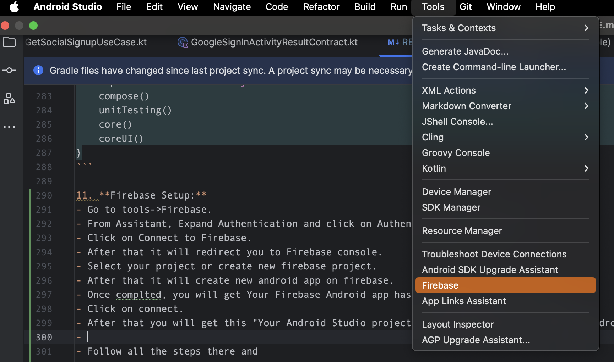
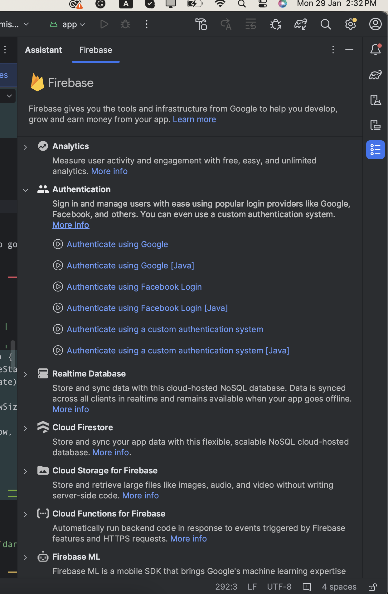
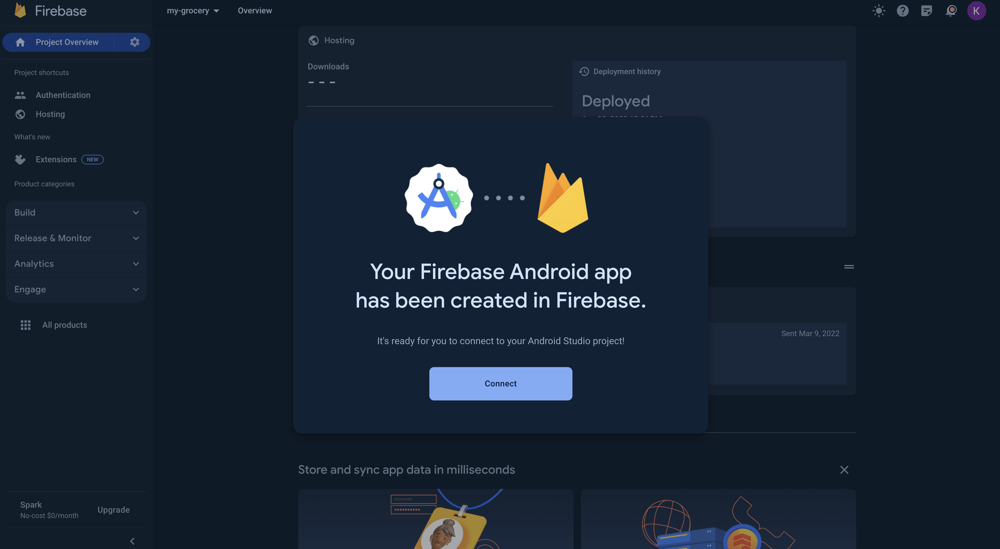
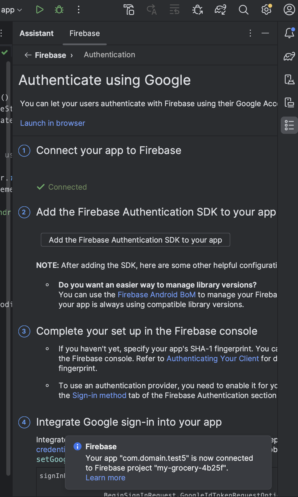
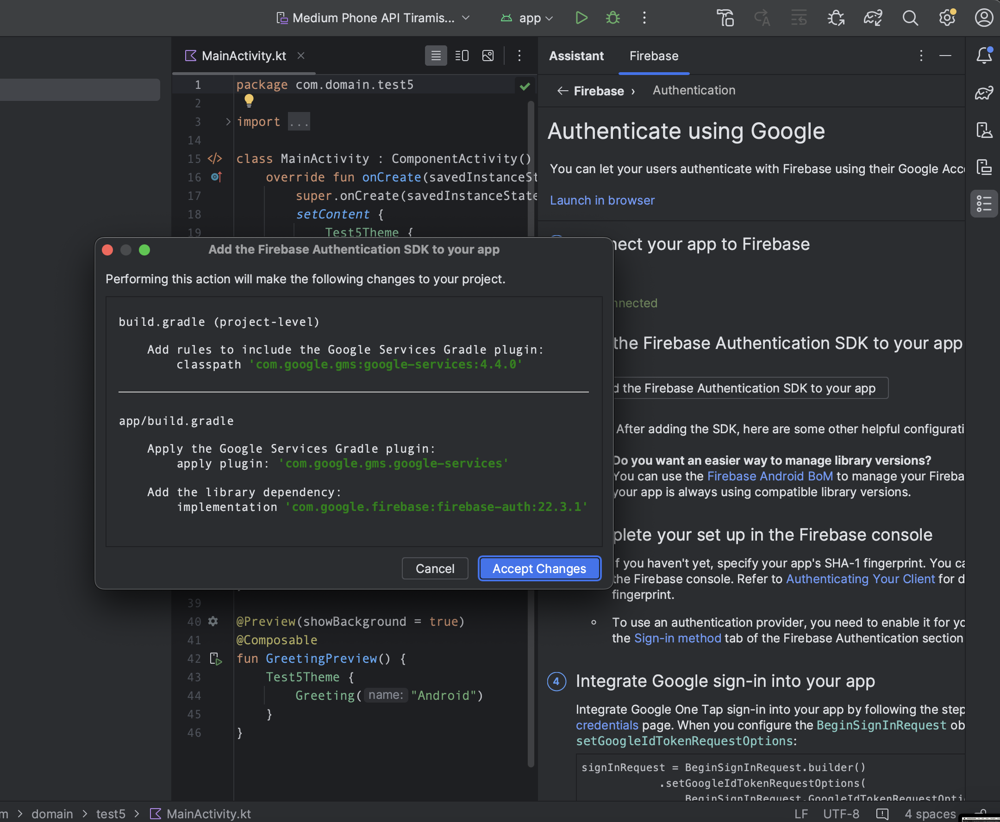
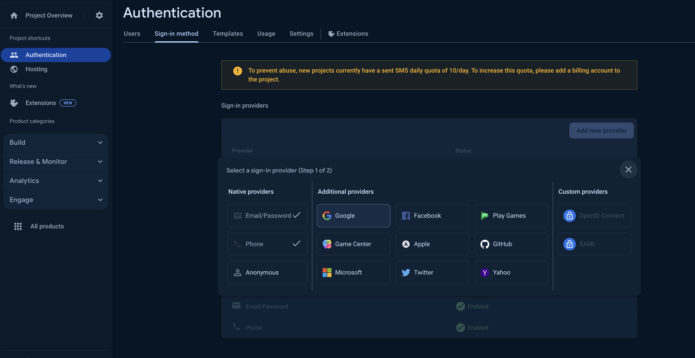
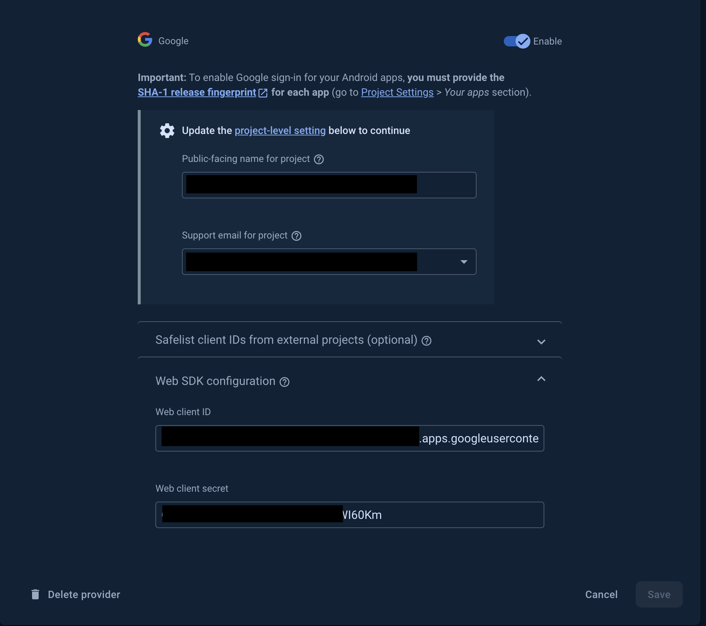

### Firebase Setup:

To integrate Firebase into your Android project, follow these steps:

1. Navigate to **Tools** -> **Firebase**.
   

2. In the Firebase Assistant, expand **Authentication** and select
   **Authenticate using Google**.
   

3. Click on **Connect to Firebase**.
   

4. You will be redirected to the Firebase console. Select your existing project
   or create a new one.

5. Once your project is selected, Firebase will create a new Android app within
   it.

6. After completion, you'll receive a confirmation that your Firebase Android
   app has been successfully created.

7. Click on **Connect** to proceed.
   

8. You'll be notified that your Android Studio project is now connected to your
   Firebase Android app.
   

9. Return to your project in Android Studio. In the Firebase Assistant, click on
   **Add the Firebase Authentication SDK to your app**.
   

10. Click on **Accept Changes**.

11. 

12. Now, go to the Firebase console, click on **Authentication** from the
    left-side panel.

13. Click on **Add new provider**.
    

14. From **Additional providers**, select **Google** and enable it.
    

15. After enabling Google, go to **Web SDK configuration** and copy the Web
    client ID. 

16. Paste the copied Web client ID in your config file
